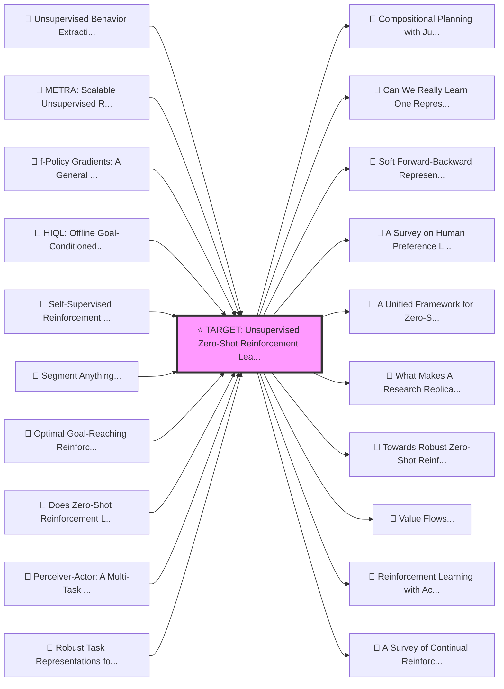

# Citation Graph: Unsupervised Zero-Shot Reinforcement Learning via Functional Reward Encodings (2024)

## Visual Citation Network
*Render this file in VSCode or GitHub to see the interactive graph!*

## Ancestors (Prior Work & Baselines)
- [REF] Unsupervised Behavior Extraction via Random Intent Priors (ID: e3b365cc2ea3a6c82eaf9428a5e7a716aa54da72)
- [REF] METRA: Scalable Unsupervised RL with Metric-Aware Abstraction (ID: 9b5dafe432446d9b627699aff65f4e81ac3fc914)
- [REF] f-Policy Gradients: A General Framework for Goal Conditioned RL using f-Divergences (ID: 2095a99fd992258995157e0e1bd67a8957a8b529)
- [REF] HIQL: Offline Goal-Conditioned RL with Latent States as Actions (ID: f18587247e4769ad0efd96a0286b012d856ba214)
- [REF] Self-Supervised Reinforcement Learning that Transfers using Random Features (ID: e325dd94c54ce753534fd2571cf89cff129e32f1)
- [REF] Segment Anything (ID: 7470a1702c8c86e6f28d32cfa315381150102f5b)
- [REF] Optimal Goal-Reaching Reinforcement Learning via Quasimetric Learning (ID: 1ad85b1a902cd37c855dbedf5bd17c536628b611)
- [REF] Does Zero-Shot Reinforcement Learning Exist? (ID: ac134b312d64b0bf01ccf15e60be4fa3016ee101)
- [REF] Perceiver-Actor: A Multi-Task Transformer for Robotic Manipulation (ID: 60c8d0619481eaafdd1189af610d0e636271fed5)
- [REF] Robust Task Representations for Offline Meta-Reinforcement Learning via Contrastive Learning (ID: a5f22a3377830e8040287726b0bf5656d26efdb3)
- [REF] Contrastive Learning as Goal-Conditioned Reinforcement Learning (ID: 53dcf467fbded741dd08902d4203a9b57e889c87)
- [REF] Hierarchical Planning Through Goal-Conditioned Offline Reinforcement Learning (ID: f593dc96b20ce8427182e773e3b2192d707706a8)
- [REF] Rethinking Goal-conditioned Supervised Learning and Its Connection to Offline RL (ID: 7f712d58084e32ddc1b0cd60932f8bc0a0916330)
- [REF] CIC: Contrastive Intrinsic Control for Unsupervised Skill Discovery (ID: 9bf925ecb1e6c6bfeecfc15aec1d0c6d7c28e135)
- [REF] Don't Change the Algorithm, Change the Data: Exploratory Data for Offline Reinforcement Learning (ID: 56a35ffb3ca0d820155e5655b527a74bf8e7b13a)
- [REF] Offline Reinforcement Learning with Implicit Q-Learning (ID: 348a855fe01f3f4273bf0ecf851ca688686dbfcc)
- [REF] Learning more skills through optimistic exploration (ID: 3c91a4534d51d21ae67e4a9f9287bb2a14dc5e3b)
- [REF] Offline Meta-Reinforcement Learning with Online Self-Supervision (ID: 61f371768cdc093828f432660e22f7a17f22e2af)
- [REF] Adversarial Intrinsic Motivation for Reinforcement Learning (ID: acacd119213ff03453816f6cb51402109d443007)
- [REF] Actionable Models: Unsupervised Offline Reinforcement Learning of Robotic Skills (ID: 677b103eecc4d34e378502d60147456875e8741b)
- [REF] Learning One Representation to Optimize All Rewards (ID: de887347a073106b33f7ebbb5cbd6cffa94a4d37)
- [REF] Multi-Task Reinforcement Learning with Context-based Representations (ID: 96b78897fba37282038bde12e48f8995d1276008)
- [REF] OPAL: Offline Primitive Discovery for Accelerating Offline Reinforcement Learning (ID: 0a321a38ba98499f17a2423f84972de29a5b2e7f)
- [REF] Accelerating Reinforcement Learning with Learned Skill Priors (ID: b68b8b980db62308864b2a7d33718182c5f8335b)
- [REF] Language Models are Few-Shot Learners (ID: 90abbc2cf38462b954ae1b772fac9532e2ccd8b0)
- [REF] D4RL: Datasets for Deep Data-Driven Reinforcement Learning (ID: a326d9f2d2d351001fece788165dbcbb524da2e4)
- [REF] Generalized Hindsight for Reinforcement Learning (ID: 7b0871c783e721bfbf9b5d16e575130a07a672cd)
- [REF] Multi-task Batch Reinforcement Learning with Metric Learning (ID: 516643d89835d9ac40bee7a88ec9516f399c3b9a)
- [REF] Dynamics-Aware Unsupervised Discovery of Skills (ID: ffb3886a253ff927bcc46b78e00409893865a68e)
- [REF] Efficient Off-Policy Meta-Reinforcement Learning via Probabilistic Context Variables (ID: 4625628163a2ee0e6cd320cd7a14b4ccded2a631)
- [REF] Attentive Neural Processes (ID: 9b396268f367917211bbd33947325e72b7742d36)
- [REF] Universal Successor Features Approximators (ID: 894536f2ac4728850bc18705daeeda6e88f3d6f1)
- [REF] Visual Reinforcement Learning with Imagined Goals (ID: 3aadab924520c58be81781aafd51e6807e9c4576)
- [REF] Neural Processes (ID: 9941a408ae031d1254bbc0fe7a63fac5f85fe347)
- [REF] Conditional Neural Processes (ID: b2504b0b2a7e06eab02a3584dd46d94a3f05ffdf)
- [REF] Diversity is All You Need: Learning Skills without a Reward Function (ID: 5b01eaef54a653ba03ddd5a978690380fbc19bfc)
- [REF] Semi-parametric Topological Memory for Navigation (ID: c0d96d1ea69855a5a3abf614f17095c29b3339a4)
- [REF] DeepMind Control Suite (ID: a9a3ed69c94a3e1c08ef1f833d9199f57736238b)
- [REF] Learning Multi-Level Hierarchies with Hindsight (ID: 17704b148b5c20ddf92acbaf1addda134ecbb474)
- [REF] Hindsight Experience Replay (ID: 429ed4c9845d0abd1f8204e1d7705919559bc2a2)
- [REF] Attention is All you Need (ID: 204e3073870fae3d05bcbc2f6a8e263d9b72e776)
- [REF] Curiosity-Driven Exploration by Self-Supervised Prediction (ID: 225ab689f41cef1dc18237ef5dab059a49950abf)
- [REF] Modular Multitask Reinforcement Learning with Policy Sketches (ID: 3a13f7c43b767b1fb72ef107ef62a4ddd48dd2a7)
- [REF] RL$^2$: Fast Reinforcement Learning via Slow Reinforcement Learning (ID: 954b01151ff13aef416d27adc60cd9a076753b1a)
- [REF] Successor Features for Transfer in Reinforcement Learning (ID: d8686b657b61a37da351af2952aabd8b281de408)
- [REF] Universal Value Function Approximators (ID: 5dc2a215bd7cd5bdd3a0baa8c967575632696fac)
- [REF] Contextual Markov Decision Processes (ID: 04955600df47c66a055591d927c024e6e9c72c61)
- [REF] Extracting and composing robust features with denoising autoencoders (ID: 843959ffdccf31c6694d135fad07425924f785b1)
- [REF] The information bottleneck method (ID: 4ef483f819e11873822416042a4b6dc4652e010c)
- [REF] Multitask Learning (ID: 161ffb54a3fdf0715b198bb57bd22f910242eb49)

## Descendants (Subsequent Work)
- [CITE] Compositional Planning with Jumpy World Models (ID: 961af0f94ae5adafcc50d12566530c272cba8a28)
- [CITE] Can We Really Learn One Representation to Optimize All Rewards? (ID: bd109e4803f2dd155b7df6a5100c86856561e077)
- [CITE] Soft Forward-Backward Representations for Zero-shot Reinforcement Learning with General Utilities (ID: ff662b01bd6fd299a6cda672a295d4de55ea663a)
- [CITE] A Survey on Human Preference Learning for Aligning Large Language Models (ID: e3a5da866598c0414dd186085ccd429ac8ea664e)
- [CITE] A Unified Framework for Zero-Shot Reinforcement Learning (ID: e5f6948a6244a551ab5f5401c0ef040b6001209f)
- [CITE] What Makes AI Research Replicable? Executable Knowledge Graphs as Scientific Knowledge Representations (ID: 2f1aeef0c5c00517febbce1732e54bff8bedc2b0)
- [CITE] Towards Robust Zero-Shot Reinforcement Learning (ID: dc6cad97b58ab3cd0501918abfcf8c6edc09bedc)
- [CITE] Value Flows (ID: 63554d91a9c4915cc17583db205c40a37bc8005c)
- [CITE] Reinforcement Learning with Action Chunking (ID: eafd15421ffb38deb1e5e3a54cf9ba2c07082cea)
- [CITE] A Survey of Continual Reinforcement Learning (ID: da5e3e299854419ea47e19a2b82800ee71e927bd)
- [CITE] Intention-Conditioned Flow Occupancy Models (ID: ec02d759dce3aabb98209de64beacd74e5bbb93e)
- [CITE] Zero-Shot Adaptation of Behavioral Foundation Models to Unseen Dynamics (ID: d24b443e6d401ea831fce8278e450d1a0da26fe6)
- [CITE] A Survey on Progress in LLM Alignment from the Perspective of Reward Design (ID: d6661217c372b9ac9678cc7851b79cd1739fd66d)
- [CITE] Zero-Shot Whole-Body Humanoid Control via Behavioral Foundation Models (ID: 85a4c2cd9a8e428fc5a65775813fefb57bd19fac)
- [CITE] PaperBench: Evaluating AI's Ability to Replicate AI Research (ID: 52be71605c60d326381a4ddfa1fb476912709504)
- [CITE] Tackling the Zero-Shot Reinforcement Learning Loss Directly (ID: e4cd8f79f59b510a7917dcc18e2e65da36559271)
- [CITE] Dual-Force: Enhanced Offline Diversity Maximization under Imitation Constraints (ID: 88056e7163a54876f8fe2e84b2889b896fca5bef)
- [CITE] Kinetix: Investigating the Training of General Agents through Open-Ended Physics-Based Control Tasks (ID: 688c324664b8bf6147281f2771e9b17edeabf45d)
- [CITE] Leveraging Skills from Unlabeled Prior Data for Efficient Online Exploration (ID: 3775bd14050cd41b32e518d2f34a85125680b2dd)
- [CITE] Zero-Shot Offline Imitation Learning via Optimal Transport (ID: 2f6511c90bf4f50be8c9be77e754282089241bd1)
- [CITE] LoopSR: Looping Sim-and-Real for Lifelong Policy Adaptation of Legged Robots (ID: 4145de15c870d44c6d7e9f406c41120efc8f7a60)
- [CITE] One-shot World Models Using a Transformer Trained on a Synthetic Prior (ID: 43ef905b6c99abc8417f63a046b39f01c8003052)
- [CITE] A Survey on Human Preference Learning for Large Language Models (ID: a5f26555194d50955f6b3fdafb04d4330cb272dc)
- [CITE] S TRESS -T ESTING O FFLINE R EWARD -F REE R EINFORCE - MENT L EARNING : A C ASE FOR P LANNING WITH L ATENT D YNAMICS M ODELS (ID: e2dcc9edc867afa96a9be965b8cf9fa04f30fbe3)